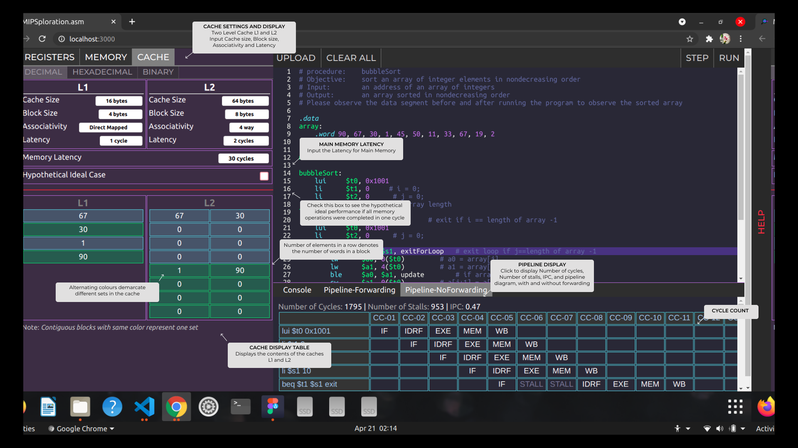

<p>
    &emsp;
    &emsp;
    &emsp;
    &emsp;
    &emsp;
</p>

# MIPSploration.asm


*MIPSploration.asm* is a web-based assembly language simulator that shows you how your MIPS assembly code alters the registers, memory and other related entities, step by step.
This project was developed as a part of the Computer Organization Lab course and aims to provide a exploratory experience of MIPS and related basic concepts of Computer Organization such as pipelining and memory heirarchy.

Here is a video demo of the simulator: https://www.youtube.com/watch?v=pbqVeBL1omE

## Get Started
This Simulator has been developed using React.

Check out our simulator here: http://mipsploration.vercel.app

Alternatively, to host it locally, run the following
1. Download the zip file (or) fork this repository and use ```git clone``` to clone it on your local desktop
2. Run ```npm install```
3. Run ```npm start```
<p>*Node is required to run the Simulator locally</p>

## How to use it
1. Enter your MIPS assembly code in the integrated code editor provided, either by typing or by using the UPLOAD option.
2. Click on RUN to process the entire code altogether and generate the pipeline
    (or)
   Click on STEP to execute each line of code step by step.
3. Observe the REGISTERS changing values in the panel on the left. 
4. Switch to the MEMORY display to observe the contents of the data segment.
5. Print outputs appear on the read-only console present at the bottom.
6. On clicking on RUN, two versions of the pipeline are generated - with forwarding and without forwarding.
7. The two pipeline tables along with the IPC and the number of stalls are displayed in the console region. Navigate to the two versions by clicking on either 'Pipeline-Forwarding' or 'Pipeline-NoForwarding' buttons next to 'Console' button.
8. Switch to the CACHE panel to change cache configuration settings and contents of the L1 and L2 caches. 
9. Click on STEP to see the changes in the caches in real time, or click on RUN to generate the final cache table configurations.
10. Click on CLEAR ALL to clear the editor, console, pipeline, registers and memory.

## Screenshots
<p>
    
    
</p>

## More on Pipeline
* There are five stages in the pipeline:                                                                                                                        
Instruction Fetch (IF), Instruction Decode/Register Fetch (ID/RF), Execute (EX), Memory (MEM) and Write Back (WB).
* The types of forwarding allowed are EX-MEM to ID/RF-EX and MEM-WB to ID/RF-EX.
* In this simulator, syscall requires the correct values of registers **$a0** and **$v0** at the EX stage. A failed ID/RF stage is represented as a STALL, hence ID/RF stage is displayed only once per instruction.

Note:
1. Large programs like BubbleSort may take up to 1 minute to execute. If an unresponsive page prompt is thrown, then please click on 'Wait' until it finishes executing.
2. The pipeline tables displayed will be trimmed to fit within 200 columns or 100 rows, in the case of long programs so as to prevent the page from slowing down.

## More on Cache
* There are two levels of cache: L1 and L2. Each level cache can be tuned independent of the other, according to the requirements.
* The replacement policy followed in both levels of cache is [LRU](https://en.wikipedia.org/wiki/Cache_replacement_policies#:~:text=LRU%2C%20like%20many%20other%20replacement,charged%20particle%20placed%20in%20it.) (Least Recently Used).
* This multi-level cache adheres to [non-inclusive](https://en.wikipedia.org/wiki/Cache_inclusion_policy#:~:text=NINE%20Policy,-Figure%203.&text=for%20block%20X.-,If%20the%20block%20is%20found%20in%20L1%20cache%2C%20then%20the,and%20returned%20to%20the%20processor.&text=If%20the%20block%20is%20not%20found%20in%20both%20L1%20and,there%20is%20no%20back%20invalidation.) inclusion policy.
* [Write-through](https://www.geeksforgeeks.org/write-through-and-write-back-in-cache/#:~:text=In%20write%20through%2C%20data%20is,power%20outage%20or%20system%20failure) write strategy has been adopted by this simulator.
- [x] Hypothetical Ideal Case:

On selecting this option in the cache settings, the cache is completely disabled and MEM latency is assumed to be 1 clock cycle. This feature has been incorporated to highlight the significant difference in the IPC in the ideal case without a memory bottleneck vs the real-world case.


## Instructions and keywords supported by MIPSploration.asm
```asm
.word
add $1, $2, $3
sub $1, $2, $3
subu $1, $2, $3
addi $1, $2, 100
bne $1, $2, 100
lw $1, 100($2)
sw $1, 100($2)
lui $1, 100
li $1, 100
beq $1, $2, 100
ble $1, $2, 100
addiu $1, $2, 100
addu $1, $2, $3
j loop
srl $a0, $a0, 1
sll $a0, $a0, 1
syscall
```

## Additional Notes
1. It is recommended to strictly follow the syntax and formatting conventions of MIPS to avoid unforeseen errors. Avoid using registers that are not allowed for user such as the **$at** register.
2. Refreshing the page or navigating to the instructions page will result in loss of contents of the editor, registers, memory and cache.

## Framework
This simulator has been built using React. Visit [React dev](https://reactjs.org/).

Icons, SVGs, templates and design are custom built on the platform [Figma](https://www.figma.com/files/recent?fuid=923224080357619403).

This simulator has been deployed on [Vercel](https://vercel.com).
